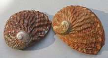

```{r setup, include=FALSE}
library(knitr)

opts_chunk$set(echo = FALSE, message = FALSE, warning = FALSE)

```


```{r Packages}
library(ggplot2)
library(dplyr)
library(broom)


theme_set(theme_bw())
```


# Введение

В этой работе мы проверим, можно ли определить возраст моллюсков на основании данных морфометрии, иными словами, существует ли линейная зависимость числа колец на спиле раковины от этих факторов. Это поможет упростить метод подсчёта возраста моллюсков, потому что точный подсчёт колец на спиле их раковины - очень долгий и трудоёмкий процесс [@yoneyama1991formation; @nash1994population].

# Материал и методика

```{r Data_loading}

abol <- read.table("Data/abalone-5.csv", sep = "\t", header = TRUE, dec = ".")

```


## Источник данных

В исследовании @nash1994population  были изучены такие морфометрические признаки моллюсков *Haliotis rubra* (Рис. 1) на `r nrow(abol)` экземплярах, как длина раковины (length), её диаметр (diameter), вес (shell weight), число колец (rings), а также общий вес моллюска (whole weight) и другие в зависимости от их гендера (sex).





## Статистическая обработка

Подбор линейной модели зависимости числа колец на спиле раковины от различных факторов был осуществлён с помощью метода наименьших квадратов [@hothorn2009handbook]. Для тестирования статистической значимости зависимости между исследованными признаками использовался дисперсионный анализ [@hothorn2009handbook], а для оценки условий применимости модели - построение графика зависимости стандартизованных остатков от предсказанных значений [@quinn2002experimental]. Корректировка модели проведена при помощи преобразования её в модель, основанную на распределении Пуассона (так как зависимая переменная - это счётная величина).

### Статистические пакеты 

Расчеты проведены в R [@R_cit] с использованием функций lm() и glm() из пакета stats;  ggplot() и fortify() из пакета ggplot2 [@ggplot_cit]. Для вывода парамтеров модели использовали пакет broo [@Broom].


# Результаты и обсуждение

```{r}
abol$sex <- factor(abol$sex)

abol_fm <-
abol %>% 
  filter(sex != "I") 

Model <- lm(rings ~ sex + diameter + shell_weight, data = abol_fm)

Model_summary <- tidy(Model)

```


Первая подобранная модель оказалась невалидной из-за гетероскедастичности, поэтому была подобрана модель, основанная на распределении Пуассона (так как зависимая переменная - это счётная величина). Оказалось, что возраст моллюсков (число колец на раковине) *Haliotis rubra* зависит от гендера, диаметра и веса раковины, а также от общего веса моллюска (см. табл. 1). 

```{r Model_summary}

kable(Model_summary, digits = c(0, 2, 3, 1, 3), col.names = 
        c("Член модели", "Оценка параметра", "SE", "t", "p-value"),
      caption = "**Таблица 1.** Параметры модели")

```


Эта зависимость описывается уравнением 

$$
R = 9.84 + 0.03Sex_{Male} -8.37D +16.43ShL
$$


На диграмме (Рис. 2) показана зависимость возраста моллюсков (число колец на раковине) от веса раковины. Красная, голубая и зелёная линии - линии регрессии для женского, мужского гендера и гермафодитов, соответственно.


```{r, fig.cap="**Рисунок 2.** Зависимость числа колец от веса раковины для моллюсков разного пола."}
ggplot(abol_fm, aes(x = shell_weight, y = rings, color = sex)) +
  geom_point() +
  geom_smooth() +
  labs(x = "Вес раковины", y = "Число колец", color = "Пол")
```


# Выводы

Наше исследование показало, что для определения возраста халиотисов можно использовать данные об их гендере и морфометрических характеристиках (диаметр и вес раковины, а также общий вес моллюсков). Это поможет в значительной степени облегчить оценку их возраста и избежать трудоёмкого подсчёта колец на спиле раковины.


# Список литературы
