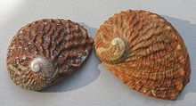

```{r setup, include=FALSE}
library(knitr)
library(dplyr)
library(ggplot2)

theme_set(theme_bw())
opts_chunk$set(echo = FALSE, message = FALSE, warning = FALSE)
```

# Введение

В этой работе мы проверим, можно ли определить возраст моллюсков на основании данных морфометрии, иными словами, существует ли линейная зависимость числа колец на спиле раковины от этих факторов. Это поможет упростить метод подсчёта возраста моллюсков, потому что точный подсчёт колец на спиле их раковины - очень долгий и трудоёмкий процесс [1, 2].

```{r}

df <- read.table("Data/abalone-5.csv", sep = "\t", header = TRUE)


```


# Методы

В исследовании Nash et al.(1994) [2] были изучены такие морфометрические признаки моллюсков *Haliotis rubra* (на `r nrow(df)` `r ifelse(nrow(df) < 1000, paste("экземпляров"), paste("ЭКЗЕМПЛЯРОВ") )` ), как длина раковины (length), её диаметр (diameter), вес (shell weight), число колец (rings), а также общий вес моллюска (whole weight) и другие в зависимости от их гендера (sex).



<br>

<!-- ```{r fig.align='center', fig.cap="Рисунок 1. Внешний вид *Haliotis rubra*", fig.height=5} -->

<!--  -->
<!-- ``` -->


Подбор линейной модели зависимости числа колец на спиле раковины от различных факторов был осуществлён с помощью метода наименьших квадратов [3]. Для тестирования статистической значимости зависимости между исследованными признаками использовался дисперсионный анализ [3], а для оценки условий применимости модели - построение графика зависимости стандартизованных остатков от предсказанных значений [4]. Корректировка модели проведена при помощи преобразования её в модель, основанную на распределении Пуассона (так как зависимая переменная - это счётная величина) [5].


Расчеты проведены в R [6, 7] с использованием функций lm() и glm() из пакета stats [7]; ggplot() и fortify() из пакета ggplot2 [8]; Anova(), residualPlot() и qqPlot() из пакета car [9]; groupp_by(), do(), ungroup() из пакета dplyr [10] и glm.nb() из пакета MASS [11].


# Результаты и обсуждение

Первая подобранная модель оказалась невалидной из-за гетероскедастичности, поэтому была подобрана модель, основанная на распределении Пуассона (так как зависимая переменная - это счётная величина). Оказалось, что возраст моллюсков (число колец на раковине) *Haliotis rubra* зависит от гендера, диаметра и веса раковины, а также от общего веса моллюска (см. табл. 1). 

```{r}
Mod <- lm(rings ~ sex + diameter, data = df)

library(broom)
summary_Mod <- tidy(Mod)

kable(summary_Mod, col.names = c("Член модели", "Параметр", "SE", "t", "p-value"), caption = "Таблица 1. Параметры подобранной модели")
```


<!-- ```{r} -->
<!-- kable(head(df)) -->

<!-- ``` -->

<!-- Таблица, описанная на языке RMarkdown -->

<!-- | ID| rings|sex | length| diameter| whole_weight| shell_weight| -->
<!-- |--:|-----:|:---|------:|--------:|------------:|------------:| -->
<!-- |  1|    10|F   |  0.585|    0.465|       0.9855|       0.2845| -->
<!-- |  2|     7|I   |  0.455|    0.350|       0.4445|       0.1115| -->


Эта зависимость описывается уравнением 

$$
rings_i = 1.62 + 0.02sex_i + 1.47diameter_i - 0.55whole-weight_i + 2.22shell-weight_i + \varepsilon_i 
$$


(см. диаг. 1).


```{r, fig.cap="Рисунок 2. Визуализация модели", fig.align='center', fig.width=5}
ggplot(df, aes(x = diameter, y = rings, color = sex)) +
  geom_point()+
  geom_smooth(method = "lm")
```

