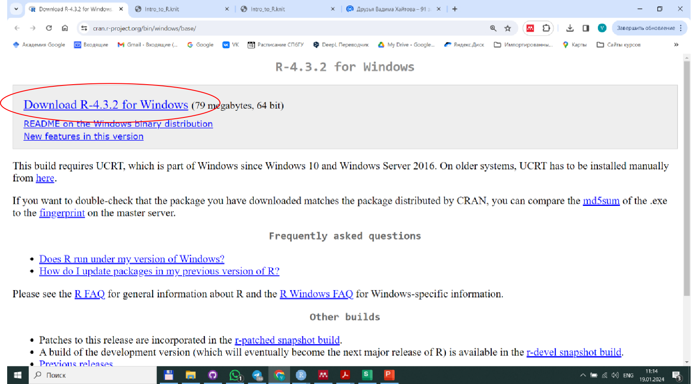
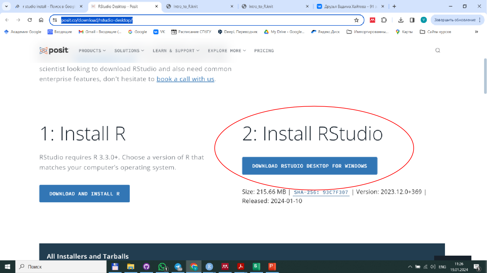

```{r setup, include=FALSE}
knitr::opts_chunk$set(echo = TRUE)
```

## Первые действия 

1. Установите на свой компьютер язык *R*. 

<br>

Ссылка для скачивания пакета устновки языка *R*: https://cran.r-project.org/bin/windows/base/

<br>




<br>
<br>


После скачивания, запустите загруженный файл **"R-4.3.2-win.exe"** и следуйте указаниям установочной программы. 
 

<br>
<br>


2. После установки языка *R*, установите прорамму *R Studio*

<br>

Ссылка для скачивания: https://posit.co/download/rstudio-desktop/

<br>



<br>
<br>


## Основы языка `R`

- [Презентация с объяснением основ](Introduction_R.pdf)
- [Первые шаги в *R*. Скрипт.](intro to R_student_script.R)
- [Первые шаги в *R*. Интерактивная презентация](01_intro_to_r.html)


<br>
<br>

### Самостоятельная работа для закрепления пройденного


1. Создайте в *R Studio* пустой скрипт. 

2. Откройте html-файл, приведенный ниже

- [Задание для самостоятельной работы](01_intro_to_r_practice.html)

3. В некоторых заданиях можно копировать куски кода из браузера, вставлять их в скрипт и производить с ними требуемые манипуляции.

4. Полученный скрипт сохраните так, чтобы именем файла было ваше имя. Пример: "*Хайтов_Вадим_Михайлович.R*"

5. Пришлите этот скрипт на почту *polydora@rambler.ru* с указанием темы "Литературное программирование, скрипт от ФИО".